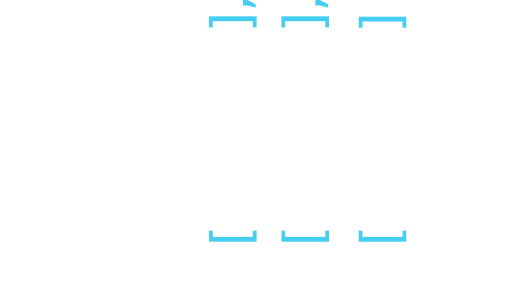

The communication with the game server works via an MQTT message broker. Depending on what you try to accomplish there are different message types your client has to support in order to participate in the game. This section contains an detailed overview of all MQTT topics and payloads that the game server supports. 

## Connecting to the MQTT Message Broker
First you have to establish a connection with the traze MQTT broker. There are multiple MQTT client libraries for various programming languages. Choose the technology of your liking and establish an anonymous connection with the broker.

| Hostname:Port | Protocol | TLS Secured |
| --- | --- | --- |
| traze.iteratec.de:1883 | MQTT | no |
| traze.iteratec.de:8883 | MQTTS | yes |
| traze.iteratec.de:8001 | WS   | no |
| traze.iteratec.de:9443 | WSS  | yes |

The broker is configured using trusted certificates so you do not have to download and trust any custom certificates.

## Select an Game Instance
You can query currently running Games. Subscribe to

`traze/games`
```json
[
    {
        "name": "instanceName",
        "activePlayers": 5
    }
]

```

## Spectate a Game

### Grid Information
The topics in this section are all subscribable.
If you want to write your own view client or an AI pilot you can do so by parsing the MQTT repersentation of the grid. It is published on the MQTT Topic

`traze/{instanceName}/grid`
```json
{
  "height":3,
  "width":3,
  "tiles":[
        [ 1, 0, 0 ],
        [ 1, 1, 2 ],
        [ 0, 2, 2 ]
    ],
  "bikes":[
      {
        "playerId":2,
        "currentLocation":[1,0],
        "direction":"W",
        "trail":[[2,0],[2,1]]
        }
   ],
   "spawns":[[2,2]]
}
```

Coordinates (tuples) are represented as JSON lists of two elements e.g. [x,y]. The coordinates have to be interpreted as shown in the illustration below. The tiles can be accessed accordingly like `tiles[1][0] == 1` in the example.



The grid topic is published on every server tick. (4 times a Second)

### Player Information

In addition to the grid you might receive a list of currently active players.

`traze/{instanceName}/players`
```json
[
   {
     "id": 1,
     "name": "player1",
     "color": "#28BA3C",
     "frags": 1,
     "owned": 2
   },
   {
     "id": 2,
     "name": "player2",
     "color": "#0A94FF",
     "frags": 2,
     "owned": 1
   }
]
```
The player topic is published every 5 seconds.

### Ticker
Finally there is a ticker topic that informs about frags that occoured on a given instance.

`traze/{instanceName}/ticker`
```json
{
  "type": "frag",
  "casualty": 2,
  "fragger": 4
}
```
The types are of `frag`, `suicide`.

The ticker topic is published whenever a death of a player occurs.

## Play the game

### Client Registration
You send a request to join the game. In return you'll get a user token that allows you to control your bike. The Response will be sent to your private MQTT topic.

`traze/{instanceName}/join`
```json
{
  "name": "myIngameNick",
  "mqttClientName": "myClientName"
}
```

If the server accepts your request you'll receive a message communicating your initial position. Once you give your first direction command your game starts.
You have to provide a unique MQTT client name in order to receive your session token on your clients own topic. It is important that you specify this very client name in the MQTT connect call to the broker, otherwise you will not be able to receive messages on the `traze/{instanceName}/player/{myClientName}` topic due to the brokers access control list settings. In order to not be subject to a MQTT deauthentication attack you should choose a client name that can not be guessed. UUIDs are a good solution.

`traze/{instanceName}/player/{myClientName}`
```json
{
    "id": 1337,
    "name": "myIngameNick",
    "secretUserToken":"de37c1bc-d0e6-4c66-aaa3-911511f43d54",
    "position": [15,3]
}
```
Because the ingame nick is part of the topic your nickname may not include `#`, `+`, `/`.

### Steering your Light Cycle
You steer by giving the directions for your next turn via an MQTT message. If you don't commit a course correction within the specified timeframe your light cycle will continue on it's previous path.

`traze/{instanceName}/{playerId}/steer`
```json
{
    "course":"N",
    "playerToken": "de37c1bc-d0e6-4c66-aaa3-911511f43d54"
}
```

The options for a course change are `N`, `S`, `E` or `W` for North, South, East and West on the grid. 

### Leaving a Game
You may leave the game at any time.

`traze/{instanceName}/{playerId}/bail`
```json
"playerToken": "yourSecretToken"
```

